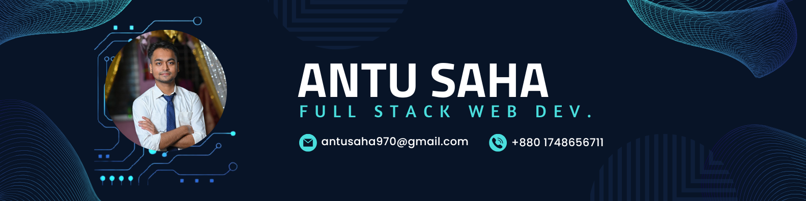

- 🌱 I’m currently learning **Full Stack Development**

- 💬 Ask me about **Python, Django,Django REST Framework,mySQL, React, JavaScript, C++, DSA**

- 📫 How to reach me **antusaha970@gmail.com**

- ⚡ Fun fact **Do smart work not hard work😀**

## 🌐 Socials:
   

# 💻 Tech Stack:
                                 

